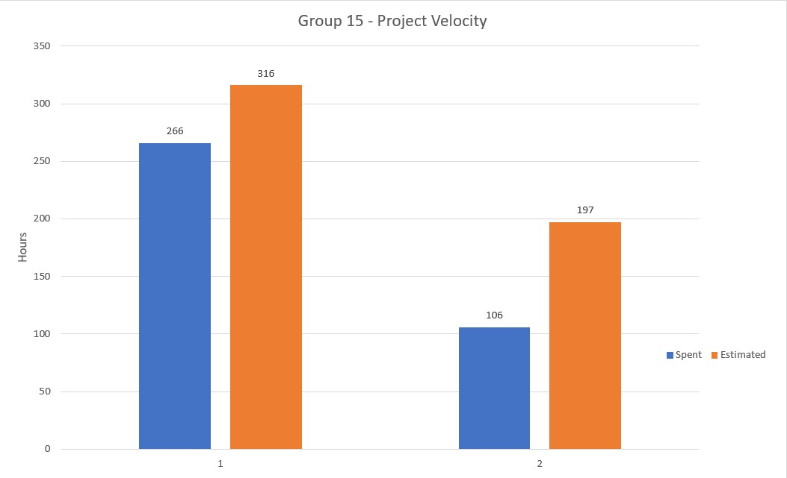

# Retrospective

During our retrospective we talked about a few things that we would have liked to have gone better. The main issue that was discussed was the number of incomplete features we had remaining in our milestones. This was primarily due to a lack of time but also due to poor planning and communication. We faced a lot of technical challenges throughout the process of building app, mainly because the process was new to all of us. We had also discussed that we might have been a little bit too ambitious with the timeline given to us and that all the time we spent developing features took away from the time we needed for testing, planning and documentation. 

For this iteration we knew that we needed to start early and be communicating often. We started by having our retrospective meeting early to discuss what we wanted to accomplish for this milestone. Now that we were more confident in our programming abilities, we knew that the development tasks would take a shorter time, so we were able to plan more accurately. We knew we all had other obligations, so we decided to only implement one new feature for this iteration and focus the rest of our time on testing and the presentation portion.

A big area for improvement was creating tests for all our classes. We would normally leave testing till the end because of the large scope of the features we wanted to implement. That would usually leave us with minimal tests that would cover very little of our logic layer. For this iteration we agreed to start with the tests and place a bigger emphasis on testing. We measured our success by setting a goal of having a system test for each of the main features and to create unit tests that fully cover our logic layer.
 
For the planning aspect we knew our success goal was to narrow down the margin between spent and estimated time. In our first iteration we had way too many hours estimated and there was never a chance of us completing it. We fixed that issue for iteration 2 but, a large margin was still there so we knew we had to put less features in because those tasks were taking up a lot of our time. Another way we could improve our planning was to estimate all the tasks when we create them and not afterwards. 

Another big area we needed to work on was adjusting the project plan and adapting to the challenges we were facing. A lot of our features we not realistic given our timeline and instead of moving features out of the iteration and into the next one we decided in our retro what we wanted to complete by presentation time. This meant we needed to communicate better with each other, so as a way of judging success we wanted at least one message from each person everyday giving updates or asking if anybody else needed help with their tasks.

## Project Velocity

